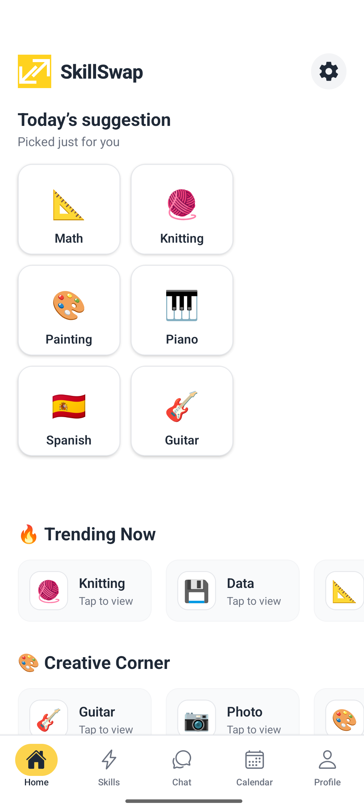
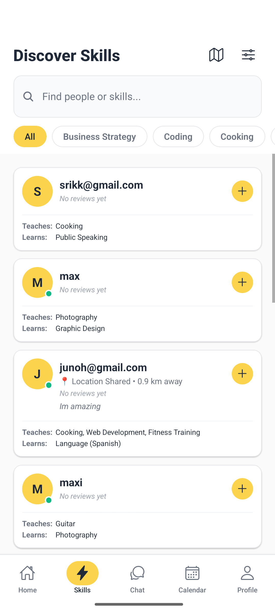
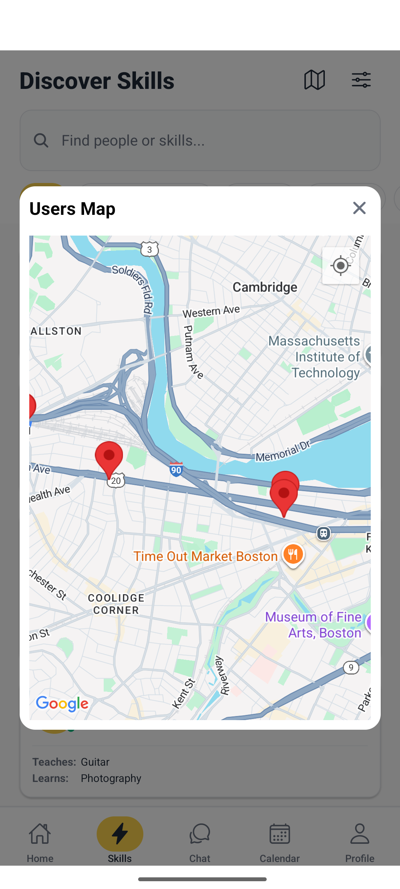
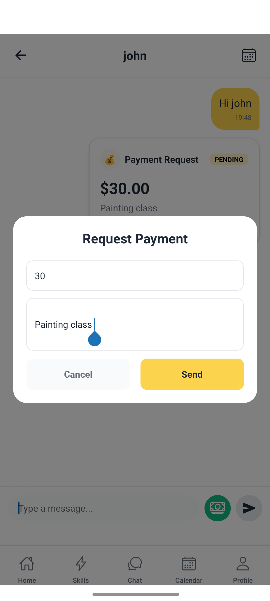
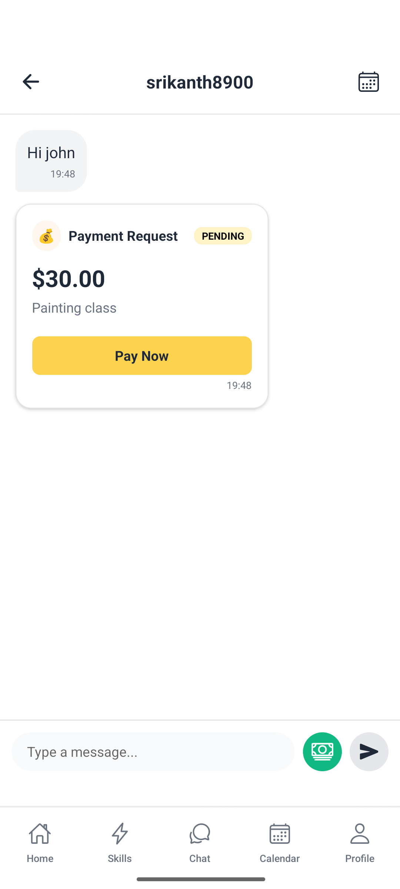
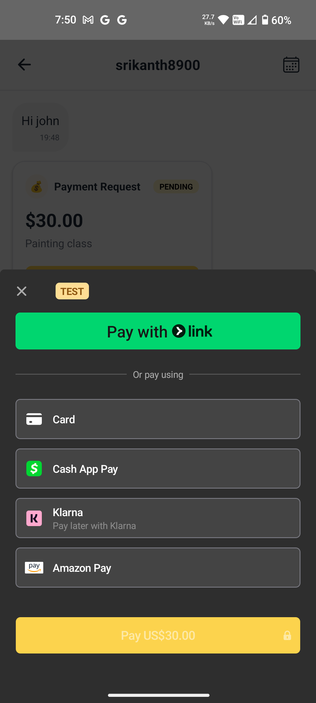
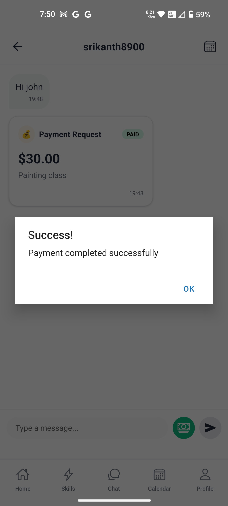
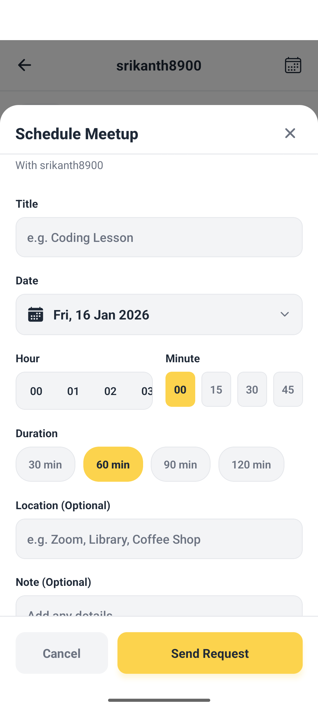
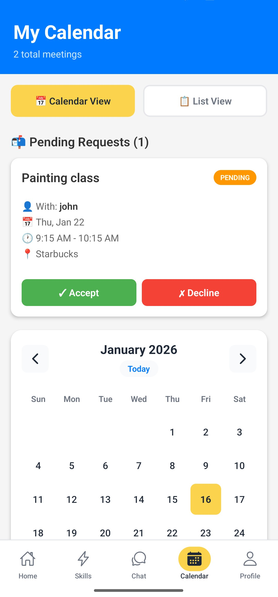
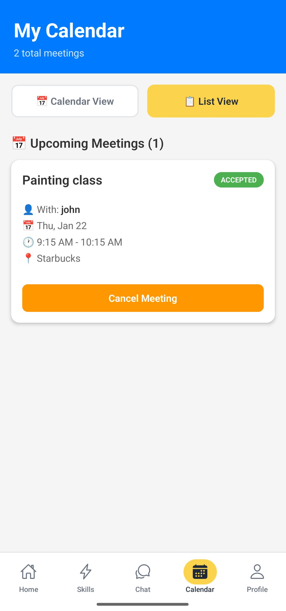

# SkillSwap 🎓

**Connect. Learn. Grow Together.**

SkillSwap is a mobile application that enables users to exchange skills through both free mutual learning and paid sessions, fostering a community-driven learning environment. Whether you want to teach cooking and learn Spanish, or offer coding lessons and learn guitar, SkillSwap connects you with the right people in your local community.

[](https://reactnative.dev/)
[](https://firebase.google.com/)
[](https://dotnet.microsoft.com/)
[](https://stripe.com/)

---

## 🎯 Motivation

Traditional learning platforms are expensive and impersonal. We identified several key challenges:

- **High Costs**: Professional tutoring services cost $50-100/hour, making learning inaccessible to many
- **Skill Gaps**: Everyone has skills they want to learn AND skills they can teach, but no easy way to connect
- **Lack of Community**: Difficulty finding local learning partners who share your interests
- **Coordination Issues**: No unified platform for scheduling, payment, and communication
- **Trust & Safety**: Concerns about meeting strangers for learning exchanges

**The Solution**: SkillSwap creates a trusted marketplace where people exchange skills, build community, and learn affordably.

---

## ✨ Key Features

### 🔍 Skill Discovery & User Search
Browse users by the skills they teach and want to learn. Filter by categories, search by keywords, and discover learning partners in your area.




**What you see:**
- Personalized skill suggestions on the home screen
- Trending skills in your community
- Creative corner showcasing popular creative skills
- User profiles with skills they teach and want to learn
- Send friend requests to connect with skill partners

---

### 📍 Location-Based Filtering
Find nearby skill partners using real-time geolocation. See who's teaching or learning skills in your area.



**What you see:**
- Interactive map showing users in your vicinity (Cambridge/Boston area shown)
- Location pins indicating skill partners near you
- Filter skills based on distance
- Discover local learning opportunities

---

### 💬 Real-Time Chat & Payment Requests
Direct messaging with integrated payment capabilities for paid skill sessions.




**What you see:**
- In-chat payment request system
- Enter amount and description for skill sessions
- Real-time payment notifications
- Payment status tracking (Pending/Paid)

---

### 💳 Secure Payment Processing
Stripe integration for safe and reliable payment transactions.




**What you see:**
- Multiple payment options:
    - Credit/Debit Card
    - Cash App Pay
    - Klarna (Pay Later)
    - Amazon Pay
- Secure Stripe checkout with TEST mode
- Payment confirmation and success notifications

---

### 📅 Meeting Scheduler
Coordinate learning sessions with built-in calendar integration.





**What you see:**
- **Schedule Meetup**: Create meetings with title, date, time, duration, and location
- **Pending Requests**: View incoming meeting requests with Accept/Decline options
- **Calendar View**: Visual calendar showing all scheduled meetings
- **List View**: Upcoming meetings with full details and ability to cancel
- Meeting details include: participant name, date/time, location, and status

---

## 🛠️ Tech Stack

### **Frontend - Mobile Application**
- **React Native** with **Expo** - Cross-platform mobile development (iOS & Android)
- **TypeScript** - Type-safe JavaScript for better code quality
- **Expo Router** - File-based navigation
- **Expo Location** - Geolocation services for user discovery
- **React Native Maps** - Interactive map visualization
- **Agora SDK** - (Planned) Real-time video calling capabilities

### **Backend - Hybrid Architecture**
- **Firebase Services**:
    - **Firebase Authentication** - Secure user authentication with email/password
    - **Cloud Firestore** - NoSQL database for real-time data storage
    - **Firebase Storage** - User profile images and media storage
    - **Firebase Security Rules** - Role-based access control

- **Custom .NET API**:
    - **C# .NET 8** - RESTful API for complex business logic
    - **ASP.NET Core** - Web API framework
    - **Payment Processing** - Stripe integration for secure transactions
    - **Calendar Management** - Meeting scheduling and coordination

### **Third-Party Integrations**
- **Stripe API** - Payment processing and financial transactions
- **Google Maps API** - Location services and mapping

### **Development Tools**
- **Git & GitHub** - Version control and collaboration
- **Postman** - API testing and documentation
- **Visual Studio Code** - Primary IDE
- **Android Studio / Xcode** - Mobile development environments

---

## 🏗️ Architecture Overview

SkillSwap follows a **Three-Tier Architecture**:

### 1. **Client Layer** (React Native + Expo)
- Cross-platform mobile UI for iOS and Android
- Real-time listeners for live data updates
- TypeScript for enhanced type safety and developer experience

### 2. **Backend Services** (Hybrid Approach)

**Firebase Services:**
- Real-time database (Firestore)
- User authentication
- File storage
- Security rules

**Custom .NET API:**
- C# .NET 8 RESTful API
- Payment processing logic (Stripe integration)
- Meeting and calendar management
- Complex business logic

### 3. **Third-Party Integrations**
- Stripe API for secure payment processing
- Expo Location for geolocation services
- Google Maps for location visualization

---

## 📱 App Flow

```
┌─────────────────────────────────────────────────────────┐
│                     User Authentication                  │
│              (Firebase Auth - Email/Password)            │
└─────────────────────────┬───────────────────────────────┘
                          │
                          ▼
┌─────────────────────────────────────────────────────────┐
│                      Home Screen                         │
│      • Today's Suggestions (Personalized Skills)        │
│      • Trending Skills                                   │
│      • Creative Corner                                   │
└────┬────────────┬───────────┬──────────────┬────────────┘
     │            │           │              │
     ▼            ▼           ▼              ▼
┌─────────┐ ┌─────────┐ ┌──────────┐ ┌────────────┐
│ Skills  │ │  Chat   │ │ Calendar │ │  Profile   │
└─────────┘ └─────────┘ └──────────┘ └────────────┘
     │            │           │              │
     │            │           │              │
     ▼            ▼           ▼              ▼
┌─────────┐ ┌─────────┐ ┌──────────┐ ┌────────────┐
│ Search  │ │ Payment │ │ Schedule │ │    Edit    │
│ Filter  │ │ Request │ │ Meeting  │ │  Profile   │
│ Map View│ │ Stripe  │ │ Accept/  │ │  Settings  │
└─────────┘ └─────────┘ │ Decline  │ └────────────┘
                        └──────────┘
```

---

## 🚀 Getting Started

### Prerequisites

- **Node.js** (v18 or later)
- **npm** or **yarn**
- **Expo CLI**: `npm install -g expo-cli`
- **Android Studio** (for Android) or **Xcode** (for iOS)
- **.NET 8 SDK** (for backend API)
- **Firebase Account** with a configured project
- **Stripe Account** for payment processing

### Installation

1. **Clone the repository**
```bash
git clone https://github.com/yourusername/skillswap.git
cd skillswap
```

2. **Install dependencies**
```bash
npm install
# or
yarn install
```

3. **Configure Firebase**
- Create a Firebase project at [Firebase Console](https://console.firebase.google.com/)
- Enable Authentication (Email/Password)
- Create a Firestore database
- Download your `google-services.json` (Android) and `GoogleService-Info.plist` (iOS)
- Add these files to your project

4. **Configure Environment Variables**

Create a `.env` file in the root directory:

```env
# Firebase Configuration
FIREBASE_API_KEY=your_api_key
FIREBASE_AUTH_DOMAIN=your_auth_domain
FIREBASE_PROJECT_ID=your_project_id
FIREBASE_STORAGE_BUCKET=your_storage_bucket
FIREBASE_MESSAGING_SENDER_ID=your_sender_id
FIREBASE_APP_ID=your_app_id

# Stripe Configuration
STRIPE_PUBLISHABLE_KEY=your_stripe_publishable_key
STRIPE_SECRET_KEY=your_stripe_secret_key

# .NET API URL
API_BASE_URL=http://your-api-url.com
```

5. **Set up the .NET Backend**

```bash
cd backend
dotnet restore
dotnet build
dotnet run
```

6. **Run the Expo app**

```bash
# Start Expo development server
npx expo start

# Run on Android
npx expo start --android

# Run on iOS
npx expo start --ios

# Run on web
npx expo start --web
```

---

## 📂 Project Structure

```
skillswap/
├── app/                          # Expo Router app directory
│   ├── (auth)/                   # Authentication screens
│   ├── (tabs)/                   # Main tab navigation
│   │   ├── home.tsx              # Home screen with suggestions
│   │   ├── skills.tsx            # Skills discovery and search
│   │   ├── chat.tsx              # Chat and messaging
│   │   ├── calendar.tsx          # Meeting scheduler
│   │   └── profile.tsx           # User profile
│   └── _layout.tsx               # Root layout
├── components/                   # Reusable components
│   ├── SkillCard.tsx
│   ├── UserCard.tsx
│   ├── ChatBubble.tsx
│   ├── PaymentRequest.tsx
│   └── MeetingCard.tsx
├── services/                     # API and service layers
│   ├── firebase/
│   │   ├── auth.ts
│   │   ├── firestore.ts
│   │   └── storage.ts
│   ├── api/
│   │   ├── payments.ts
│   │   └── meetings.ts
│   └── location/
│       └── geolocation.ts
├── types/                        # TypeScript type definitions
├── utils/                        # Utility functions
├── assets/                       # Images, fonts, etc.
├── screenshots/                  # App screenshots for README
├── backend/                      # .NET Backend API
│   ├── Controllers/
│   ├── Models/
│   ├── Services/
│   └── Program.cs
├── .env.example                  # Environment variables template
├── app.json                      # Expo configuration
├── package.json
└── README.md
```

---

## 🎯 Target Audience

### **College Students**
- Budget-conscious learners seeking affordable skill development
- Want to monetize their existing skills (coding, languages, music)
- Need flexible scheduling around classes

### **Young Professionals**
- Career-focused individuals wanting to learn new skills for advancement
- Have expertise to share from their work experience
- Value networking with like-minded people

### **Hobbyists & Lifelong Learners**
- Passionate about sharing and learning hobbies
- Want to build local community around interests
- Enjoy teaching and helping others grow

**Value Proposition**: Access affordable learning, monetize your expertise, and build meaningful connections in your local community.

---

## 🔮 Future Enhancements

### **Video Integration**
- Real-time video calls for remote skill sessions
- Screen sharing for technical skills (coding, design)
- Session recording for review and reference

### **AI-Powered Recommendations**
- Smart skill matching based on user preferences and behavior
- Personalized user suggestions
- Optimal meeting time recommendations using ML

### **Group Sessions**
- Support for group learning events (workshops, classes)
- Handle up to 20 participants per session
- Collaborative learning experiences

### **Additional Features**
- Push notifications for meeting reminders
- Rating and review system enhancement
- Skill verification badges
- Achievement and gamification system
- Multi-language support


---

## 📄 License

This project is licensed under the MIT License - see the [LICENSE](LICENSE) file for details.

---


## ⭐ Show Your Support

If you find this project helpful or interesting, please consider giving it a star! ⭐

---

**Built with ❤️ by the SkillSwap Team**